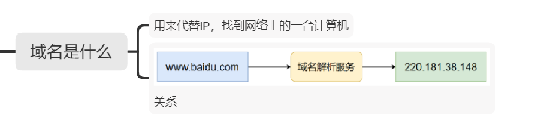
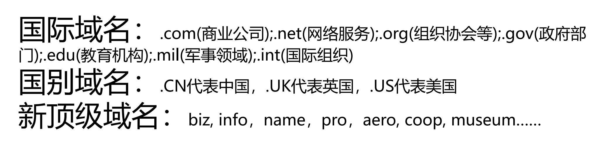
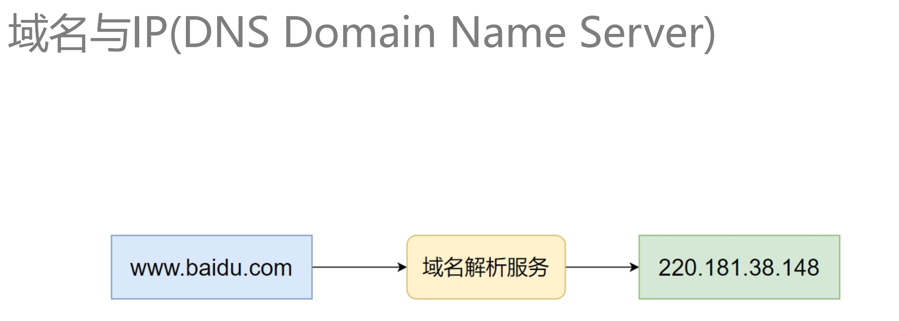
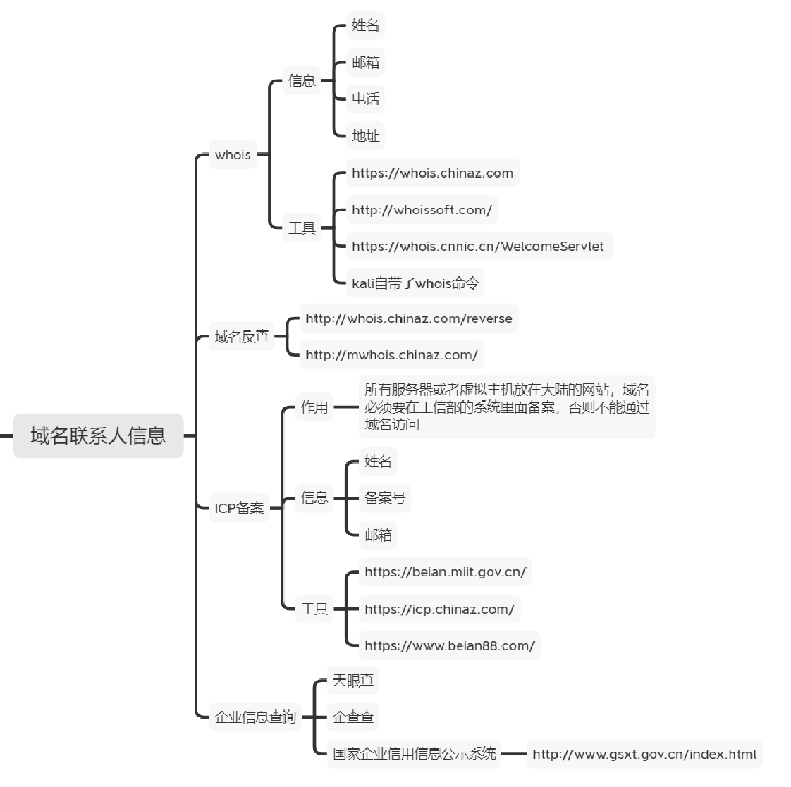
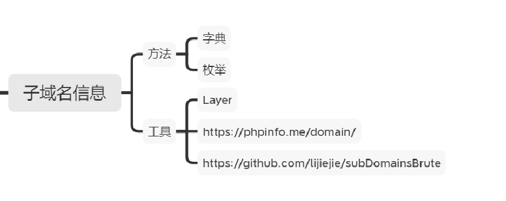
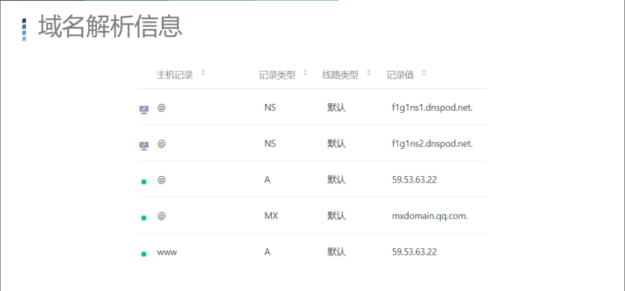
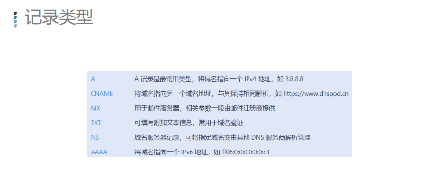
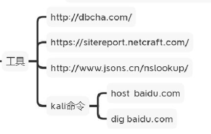

#### 域名是什么？

#### 域名的分类

#### 域名归属人的信息

所属人、邮箱、电话、地址……

#### whois

**.com由域名运营商VeriSign管理**

**cn域名由CNNIC管理**

#### whois工具

**https://whois.chinaz.com http://whoissoft.com https://whois.cnnic.cn/WelcomeServlet**

kali whois命令

#### 域名反查

http://whois.chinaz.com/reverse

#### 怎么查询子域名？

1、字典猜解

2、枚举

#### 域名解析信息

