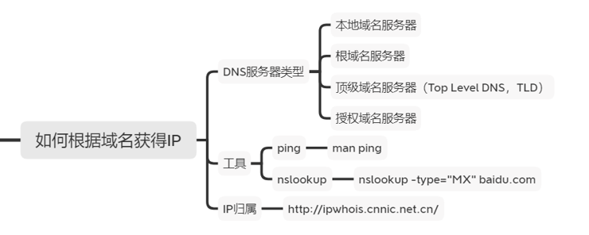
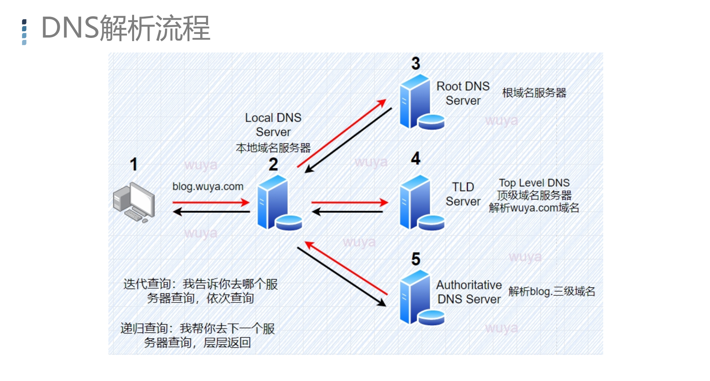
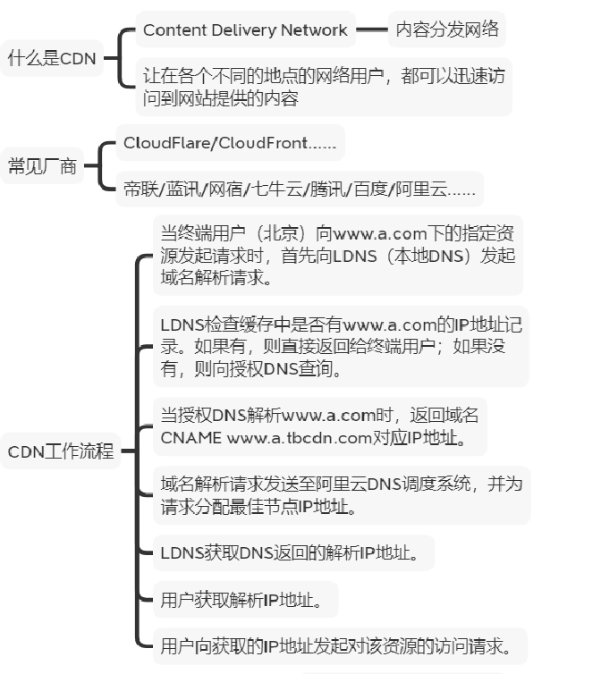
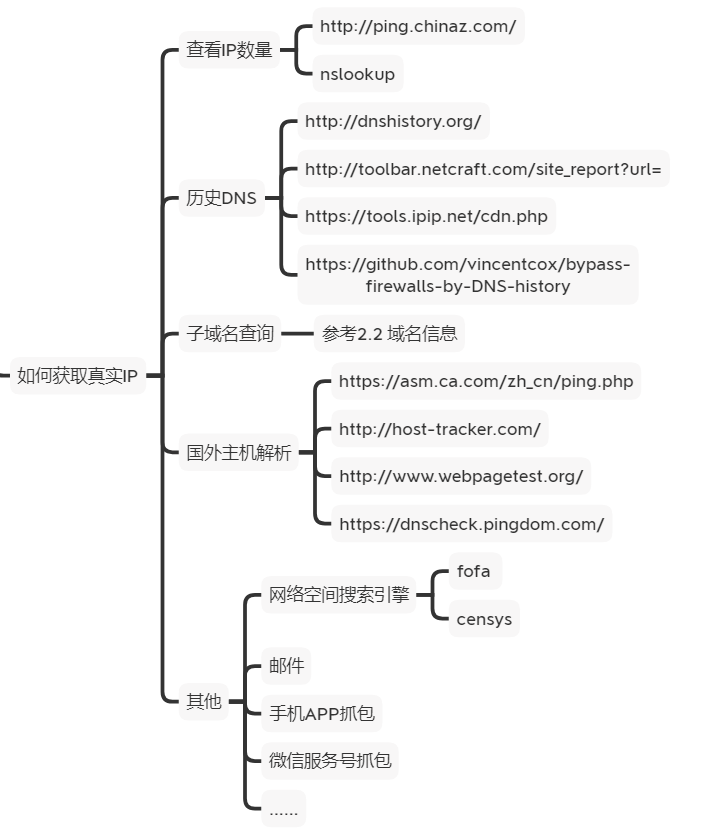
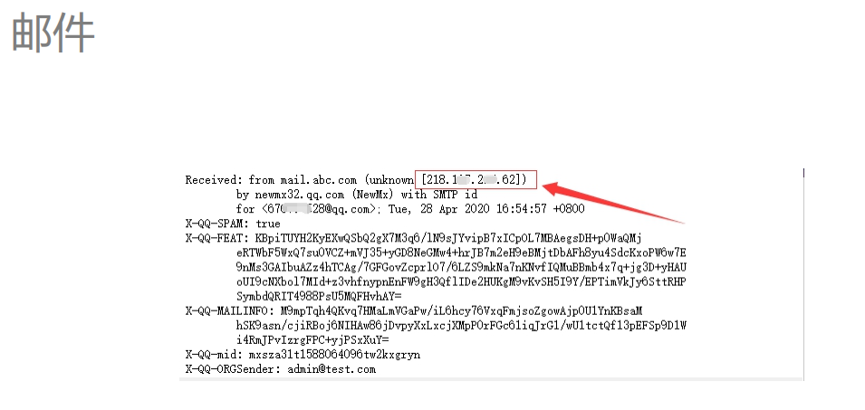

#### 如何根据域名获得IP

#### DNS解析流程

#### ping / nslookup

**PING**

P**acket **In**ternet **G**roper因特网包探索器**

**nslookup**

nslookup -type="MX" baidu.com

#### 查看IP归属

http://ipwhois.cnnic.net.cn/

#### 如何获得CDN背后的真实IP

#### 实现流程（以阿里云为例）

**https://www.zhihu.com/question/36514327/answer/1604554133**

1. 当终端用户（北京）向www.a.com下的指定资源发起请求时，首先

向LDNS（本地DNS）发起域名解析请求。

2. LDNS检查缓存中是否有www.a.com的IP地址记录。如果有，则直

接返回给终端用户；如果没有，则向授权DNS查询。

3. 当授权DNS解析www.a.com时，返回域名CNAME

www.a.tbcdn.com对应IP地址。

4. 域名解析请求发送至阿里云DNS调度系统，并为请求分配最佳节点

IP地址。

5. LDNS获取DNS返回的解析IP地址。
6. 用户获取解析IP地址。
7. 用户向获取的IP地址发起对该资源的访问请求

