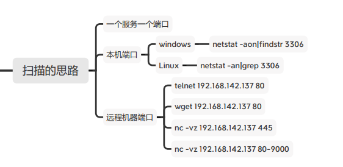
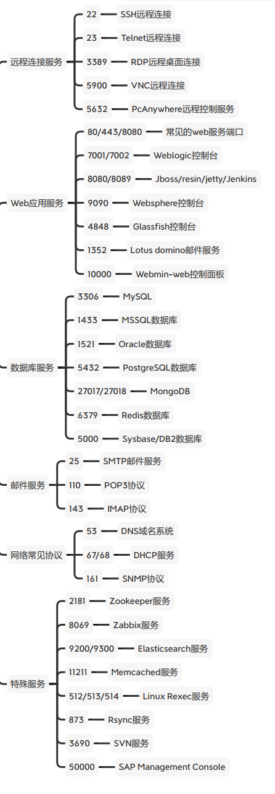
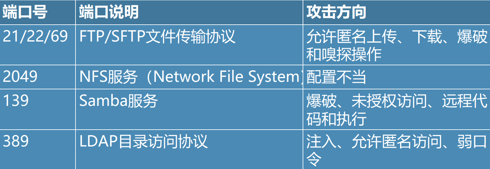
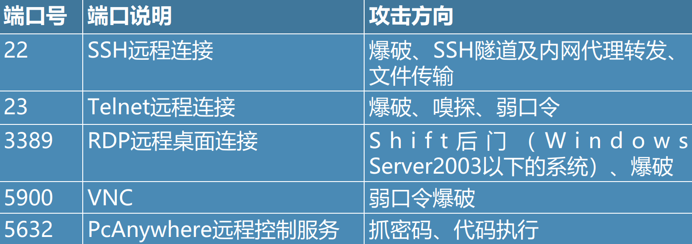
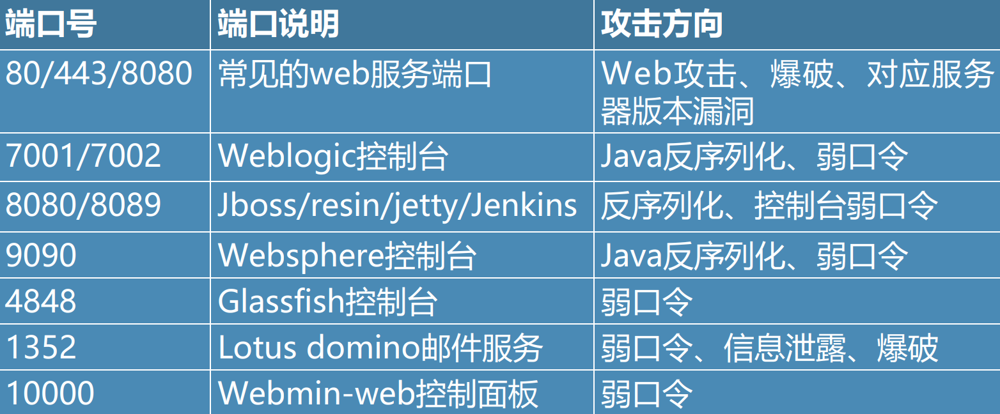
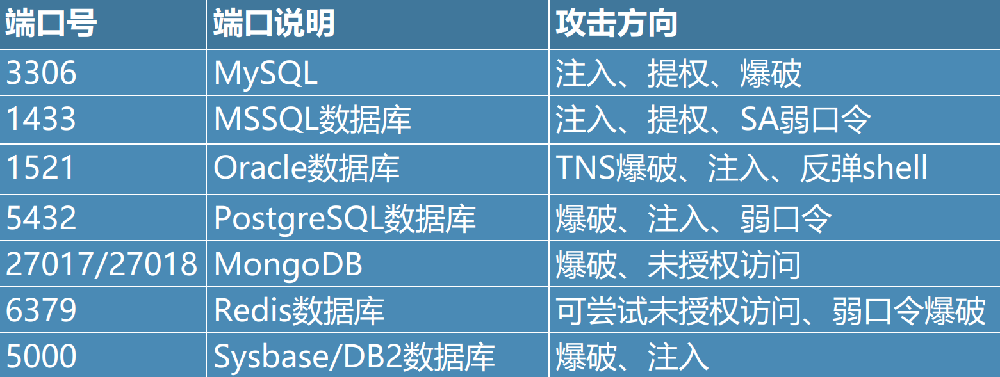
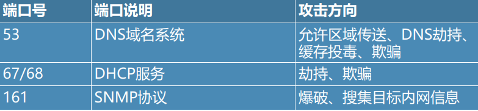
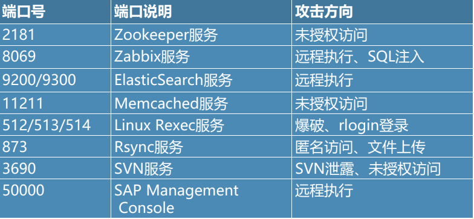
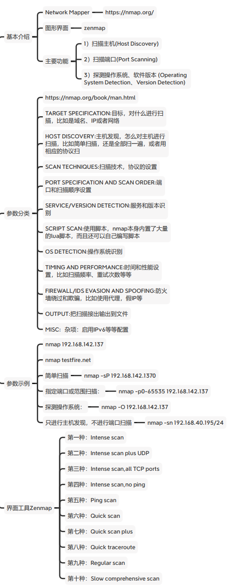

#### 端口扫描思路和代码实现



##### 查看本机端口信息

Windows

netstat -aon|findstr 3306

Linux

netstat -an|grep 3306

##### 远程机器端口

telnet 192.168.142.137 80

wget 192.168.142.137 80

nc -vz 192.168.142.137 445

nc -vz 192.168.142.137 80-9000

##### python代码扫描

wscan.py

#### 常见端口及漏洞

##### 常见端口

[(Cheat Sheet - Common Ports) (nsrc.org)](https://nsrc.org/workshops/2009/summer/presentations/day3/common-ports.pdf)




##### 分类

1、文件共享服务

2、远程连接服务

3、Web应用服务

4、数据库服务

5、邮件服务

6、网络常见协议

7、其他服务端口

##### 文件共享服务端口



##### 远程连接服务端口



##### web应用服务端口



##### 数据库服务端口



##### 邮件服务端口


##### 网络常见协议端口



**特殊服务端口**



#### 端口扫描工具

##### Nmap

Nmap（Network Mapper） https://nmap.org/

1）扫描主机(Host Discovery)

2）扫描端口(Port Scanning)

3）探测操作系统、软件版本 (Operating System Detection、Version Detection)

##### 参数类型

nmap --help

```
TARGET SPECIFICATION:目标，对什么进行扫描，比如是域名、IP或者网络l 
HOST DISCOVERY:主机发现，怎么对主机进行扫描，比如简单扫描，还是全部扫一遍，或者用相应的协议扫
SCAN TECHNIQUES:扫描技术，协议的设置
PORT SPECIFICATION AND SCAN ORDER:端口和扫描顺序设置
SERVICE/VERSION DETECTION:服务和版本识别l SCRIPT SCAN:使用脚本，nmap本身内置了大量的lua脚本，而且还可以自己编写脚本
OS DETECTION:操作系统识别 
TIMING AND PERFORMANCE:时间和性能设置，比如扫描频率、重试次数等等
FIREWALL/IDS EVASION AND SPOOFING:防火墙绕过和欺骗，比如使用代理，假IP等OUTPUT:把扫描接出输出到文件
MISC: 启用IPv6等等配置
```

##### 脚本

nmap本身内置了大量的lua脚本，而且还可以自己编写脚本ls /usr/share/nmap/scripts/ | wc -l

全部清单：https://nmap.org/nsedoc/index.html

例如：

nmap 192.168.142.137 --script http-enum 列举HTTP服务

nmap --script=auth 绕过鉴权

nmap --script=brute 暴力破解

nmap --script=vuln 扫描漏洞

##### 安装metasploitable2 Linux靶机

虚拟机文件在网盘

下载、解压、导入VM

默认用户名密码

msfadmin/msfadmin

修改root密码：

sudo passwd root

##### 使用示例

nmap 192.168.142.137 # metasploitable2 Linux

nmap testfire.net **#** IBM的一个靶场

##### 常用参数

简单扫描

nmap -sP 192.168.142.137

指定端口或范围扫描：

nmap -p0-65535 192.168.142.137探测操作系统：

nmap -O 192.168.142.137

只进行主机发现，不进行端口扫描nmap -sn 192.168.40.195/24

##### IP后面的 /24是什么意思？

掩码的位数。

子网掩码8位，11111111.00000000.00000000.00000000 代表： 255.0.0.0（A类IP地址）

子网掩码16位，11111111.11111111.00000000.00000000 代表： 255.255.0.0（B类IP地址）

子网掩码24位，11111111.11111111.11111111.00000000 代表： 255.255.255.0（C类IP地址）

旁站：和目标网站在同一台服务器但端口不同的其他网站。

C段 ：和目标服务器IP处在同一个C段的其它服务器

##### Zenmap

第一种：Intense scan

第二种：Intense scan plus UDP

第三种：Intense scan,all TCP ports

第四种：Intense scan,no ping

第五种：Ping scan

第六种：Quick scan

第七种：Quick scan plus

第八种：Quick traceroute

第九种：Regular scan

第十种：Slow comprehensive scan





#### 其他扫描工具

在线扫描http://coolaf.com/tool/port

masscan、nbtscan……
