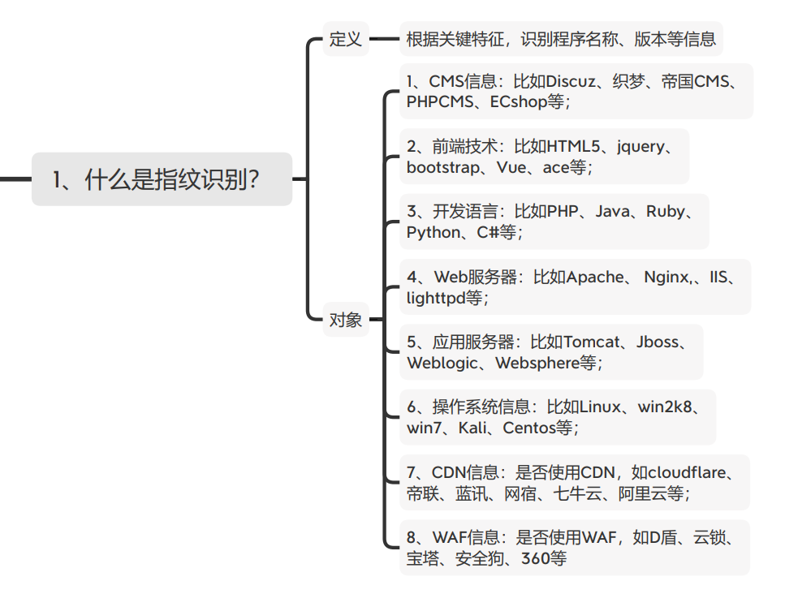
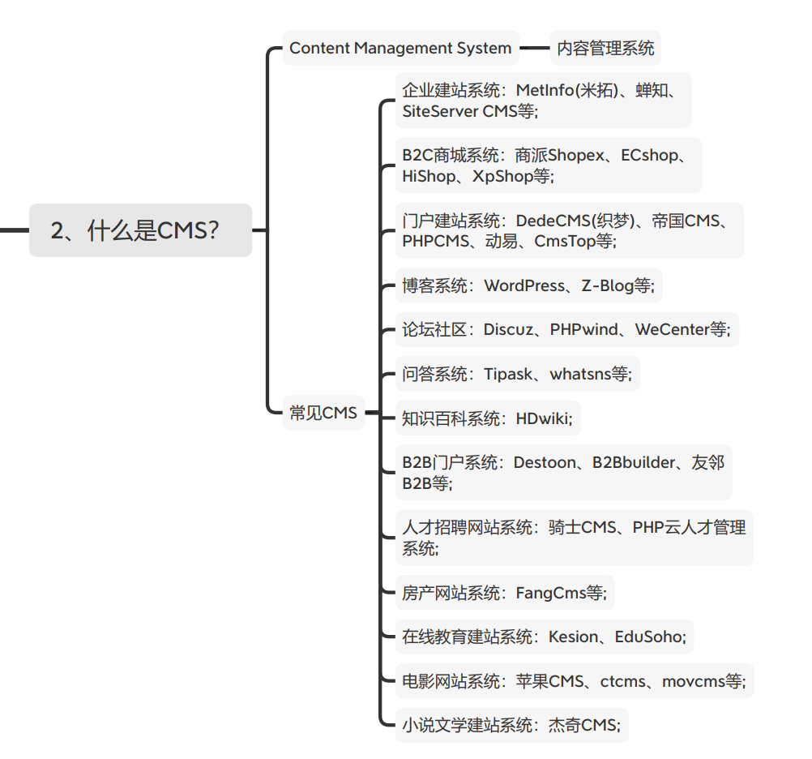
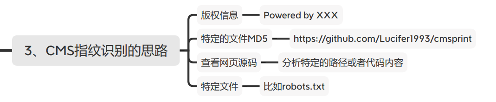
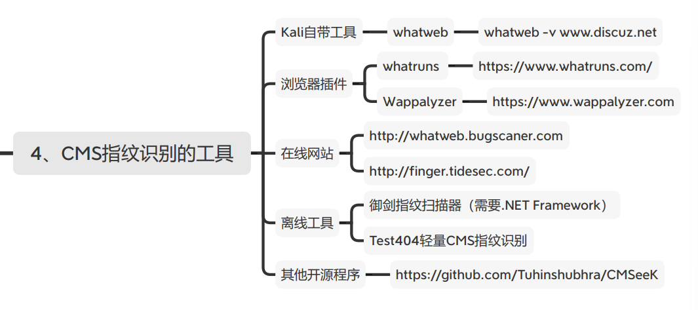

#### 什么是指纹识别？

通过**关键特征**，识别出目标的CMS系统、服务器、开发语言、操作系统、CDN、WAF的类别版本等等

**识别对象**

```
1、CMS信息：比如Discuz、织梦、帝国CMS、PHPCMS、ECshop等；
2、前端技术：比如HTML5、jquery、bootstrap、Vue、ace等；
3、开发语言：比如PHP、Java、Ruby、Python、C#等；
4、Web服务器：比如Apache、 Nginx、IIS、lighttpd等；
5、应用服务器：比如Tomcat、Jboss、Weblogic、Websphere等；
6、操作系统信息：比如Linux、win2k8、win7、Kali、Centos等；
7、CDN信息：是否使用CDN，如cloudflare、帝联、蓝讯、网宿、七牛云、阿里云等；
8、WAF信息：是否使用WAF，如D盾、云锁、宝塔、安全狗、360等
```




#### CMS指纹识别

##### CMS怎么来的？

**内容管理系统**

**Content **M**anagement **S**ystem如果你要搭建一个论坛…**…




##### CMS包括什么？

博客（比如CSDN、博客园）、微博、团购网站、导航网站（hao123）、信息分类（58）、问答网站（知乎）、商城、百科……

企业官网、学校官网、医院官网……


##### 主流（开源）CMS


##### 各类网站开源CMS

```
企业建站系统：MetInfo(米拓)、蝉知、SiteServer CMS等;
B2C商城系统：商派Shopex、ECshop、HiShop、XpShop等;
门户建站系统：DedeCMS(织梦)、帝国CMS、PHPCMS、动易、CmsTop等;
博客系统：WordPress、Z-Blog等;
论坛社区：Discuz、PHPwind、WeCenter等;
问答系统：Tipask、whatsns等;
知识百科系统：HDwiki;
B2B门户系统：Destoon、B2Bbuilder、友邻B2B等;
人才招聘网站系统：骑士CMS、PHP云人才管理系统;
房产网站系统：FangCms等;
在线教育建站系统：Kesion、EduSoho;
电影网站系统：苹果CMS、ctcms、movcms等;
小说文学建站系统：杰奇CMS;
```


#### CMS识别思路

##### CMS指纹识别思路

版权信息

特定文件MD5值

查看网页源代码

通过特定文件分析

……




#### CMS识别工具

##### kali自带工具

whatweb


##### 浏览器插件

Wappalyzer：https://www.wappalyzer.com 

whatruns ：https://www.whatruns.com/


##### 在线网站

http://whatweb.bugscaner.com 

http://finger.tidesec.com/


##### 离线网站

御剑指纹扫描器（需要.NET Framework） Test404轻量CMS指纹识别 v2.1


##### 其他开源程序

https://github.com/Tuhinshubhra/CMSeeK



