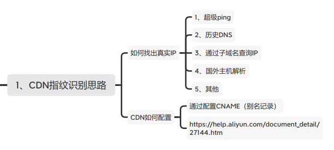
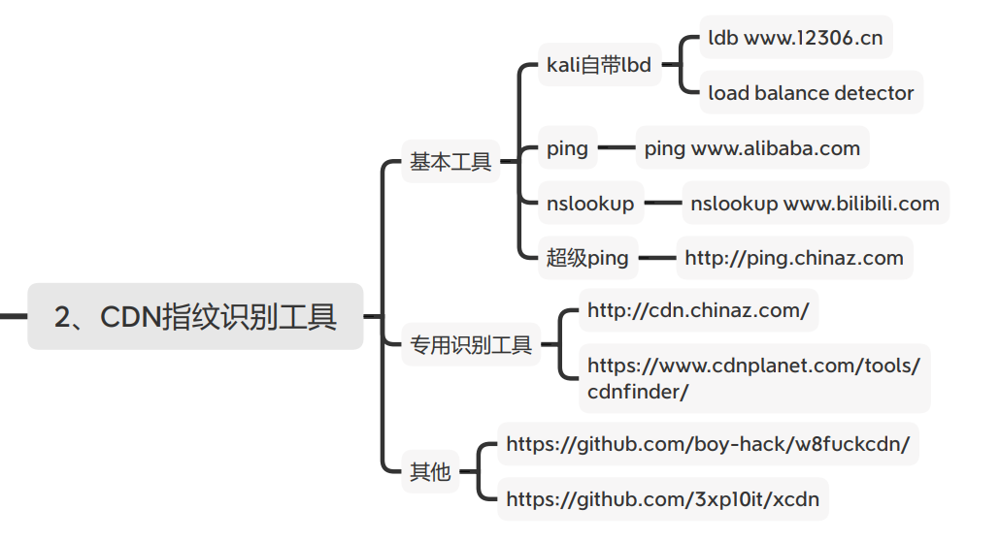

#### CDN指纹识别思路



##### 如何获取CDN背后的真实IP

```sql
超级ping
历史DNS
通过子域名查询IP
国外主机解析
其他
```

##### CDN如何配置？

通过DNS解析记录的CNAME解析到CDN服务器


#### CDN指纹识别工具



##### 常规

```sql
ping
nslookup
超级ping
ldb（load balance detector
```


##### 专用工具

```sql
国内： 
http://cdn.chinaz.com/
国外： 
https://www.cdnplanet.com/tools/cdnfinder/
脚本：
https://github.com/boy-hack/w8fuckcdn/ 			     	       			     https://github.com/3xp10it/xcdn
```
