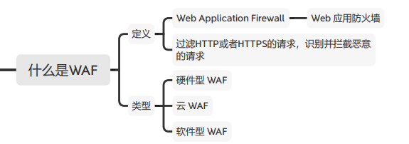
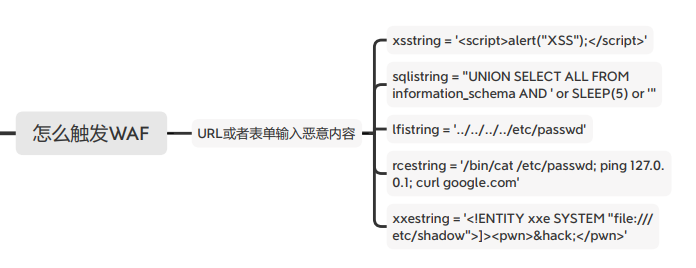

#### 什么是WAF

##### 什么是WAF

W**eb **A**pplication **F**irewall Web 应用防火墙**

过滤HTTP/HTTPS的请求



##### WAF的作用

```sql
SQL Injection (SQLi)：阻止SQL注入
Cross Site Scripting (XSS)：阻止跨站脚本攻击
Local File Inclusion (LFI)：阻止利用本地文件包含漏洞进行攻击
Remote File Inclusione(RFI)：阻止利用远程文件包含漏洞进行攻击
Remote Code Execution (RCE)：阻止利用远程命令执行漏洞进行攻击
PHP Code Injectiod：阻止PHP代码注入
HTTP Protocol Violations：阻止违反HTTP协议的恶意访问
HTTPoxy：阻止利用远程代理感染漏洞进行攻击
Sshllshock：阻止利用Shellshock漏洞进行攻击
Session Fixation：阻止利用Session会话ID不变的漏洞进行攻击
Scanner Detection：阻止黑客扫描网站
Metadata/Error Leakages：阻止源代码/错误信息泄露
Project Honey Pot Blacklist：蜜罐项目黑名单
GeoIP Country Blocking：根据判断IP地址归属地来进行IP阻断
```

##### WAF分类

硬件型 WAF（厂商安装）

云 WAF（阿里云、腾讯云、华为云……）

软件型 WAF（部署在 Apache、Nginx 等 HTTP Server 中）

##### 常见WAF厂商

各种云：阿里云、腾讯云、华为云、百度云……

安全狗、宝塔、360、知道创宇、长亭、安恒……


#### WAF指纹识别思路

##### 识别思路

额外的cookie；

任何响应或请求的附加标头；响应内容（如果被阻止请求）；响应代码（如果被阻止请求）； IP地址（云WAF）；

JS客户端模块（客户端WAF）


##### 如何触发拦截？

xsstring = '`<script>`alert("XSS");`</script>`'

sqlistring = "UNION SELECT ALL FROM information_schema AND ' or SLEEP(5) or '" lfistring = '../../../../etc/passwd'

rcestring = '/bin/cat /etc/passwd; ping 127.0.0.1; curl google.com'

xxestring = '`<!ENTITY xxe SYSTEM "file:///etc/shadow">`]>`<pwn>`&hack;`</pwn>`'




##### 指纹库

https://github.com/CSecGroup/wafid/blob/master/fing er.xml


#### WAF指纹识别工具

##### 工具

Kali自带： https://github.com/EnableSecurity/**wafw00f**用法：wafw00f https://www.12306.cn

nmap www.12306.cn --script=http-waf-detect.nse sqlmap -u "xxx.com?id=1" --identify-waf

其他： https://github.com/0xInfection/Awesome-WAF
