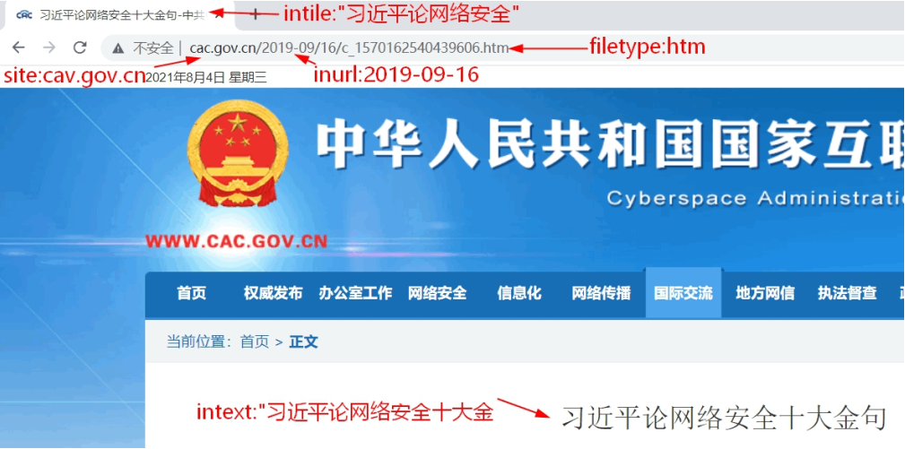

#### Google Hacking

##### 来源

2002年

Johnny Long

#### 运算符

##### 运算符

完整匹配：""

剔除不需要的内容： -

#### 高级语法

##### 高级搜索

##### 示例

##### 语法数据库

https://www.exploit-db.com/google-hacking-database https://github.com/BullsEye0/google_dork_list

##### 工具

https://github.com/m3n0sd0n4ld/uDork

