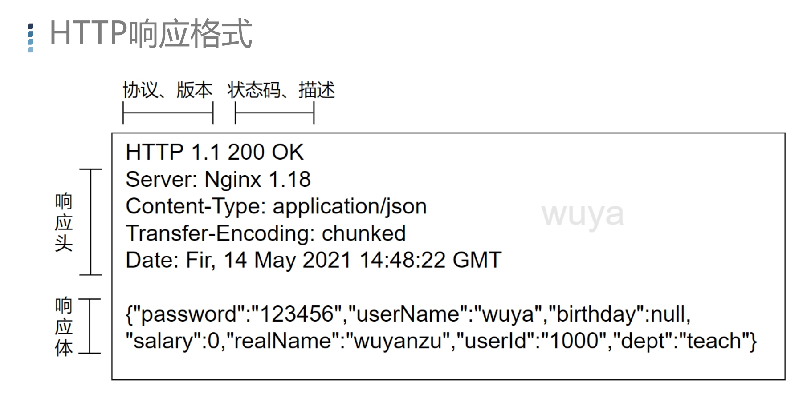
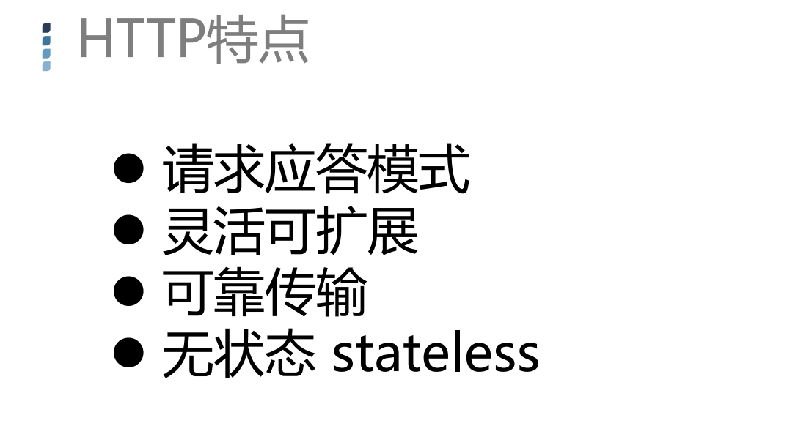

#### 课程大纲


#### HTTP请求方式


#### HTTP请求格式

客户端请求服务端格式


Accept:能够接受服务端什么类型的返回      图片……

Referer:代表这次请求是从哪个地址跳转过来的

Accept-Languce:代表能够接受的服务器的语言的类型

UserAgent:发送请求的应用程序名称

Content-Type:响应正文的类型（是图片还是二进制字符串）

Host:接受请求的服务器地址，可以是IP端口号，也可以是域名

Content-Length:响应正文长度

Connection:指定与连接相关的属性，如Connection:Keep-Alive

Cache-Control:

Cookie:

name=wuya&password=123456 	//上传了name和password两个字段的数据


#### HTTP响应格式

服务端响应客户端的格式




# HTTP 响应状态码

```
HTTP 响应状态码用来表明特定 HTTP 请求是否成功完成。 响应被归为以下五大类：
1.信息响应 (100–199)
2.成功响应 (200–299)
3.重定向消息 (300–399)
4.客户端错误响应 (400–499)
5.服务端错误响应 (500–599)
```




请求应答模式

 1.1版本以前，如果客户端不发起请求，服务端则不会响应

 2.0版本 推出了push技术  即使客户端不发起请求，服务端也会推送内容


灵活可扩展

http协议不限制请求内容


可靠传输

 http  应用层   


无状态 stateless

客户端的每一次请求都是完全独立，对于服务器来说不知道客户端是谁，不知道曾经干过什么。


加密存储在本地，cookie


