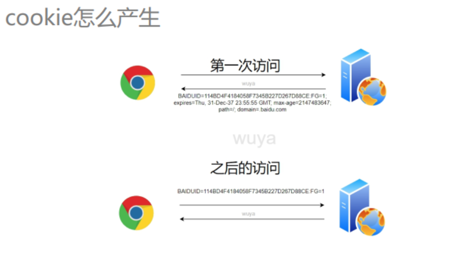
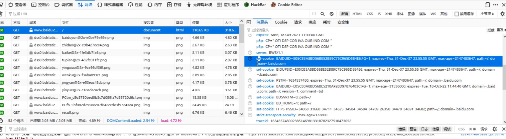
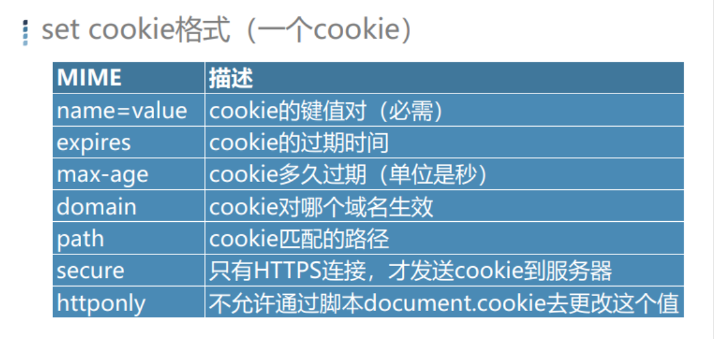
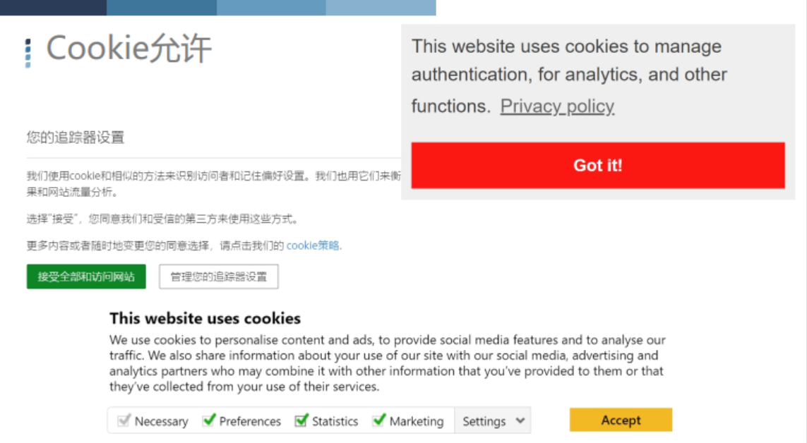

#### 无状态的影响

现实：每个请求都是独立的

需求：保持**会话**

#### Cookie内容

key/value 格式，例如：

name=wuya 

id=99 

islogin=1

#### Cookie怎么产生的？

#### Cookie格式

Set-Cookie：第一次访问，服务器响应给客户端

Cookie：之后的访问，客户端发送给服务器

name：BAIDUID

value：E05cB3A…… 

属性：

expires：过期的时间 （格林威治的标准时间）

max-age：过期时间，cookie保存多久失效，以秒来计时。判断过期时间以此为准

#### Cookie特点

Structured Query Language

1、明文

2、可修改

3、大小受限（视浏览器而定）

#### Cookie的用途

Structured Query Language

1、记住登录状态

2、跟踪用户行为

**Cookie允许**

