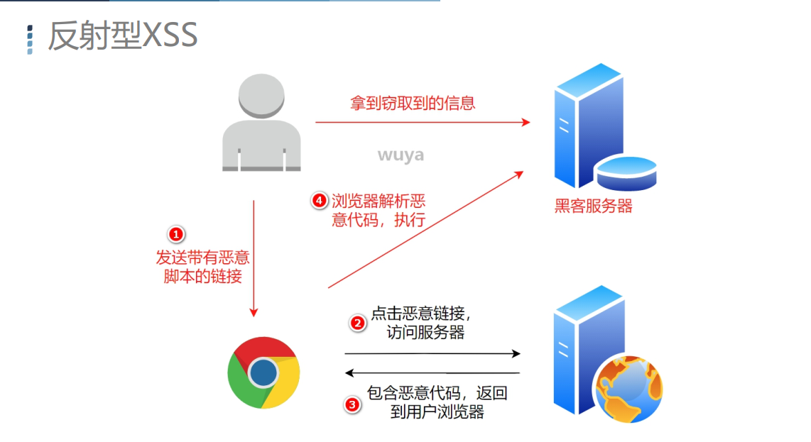
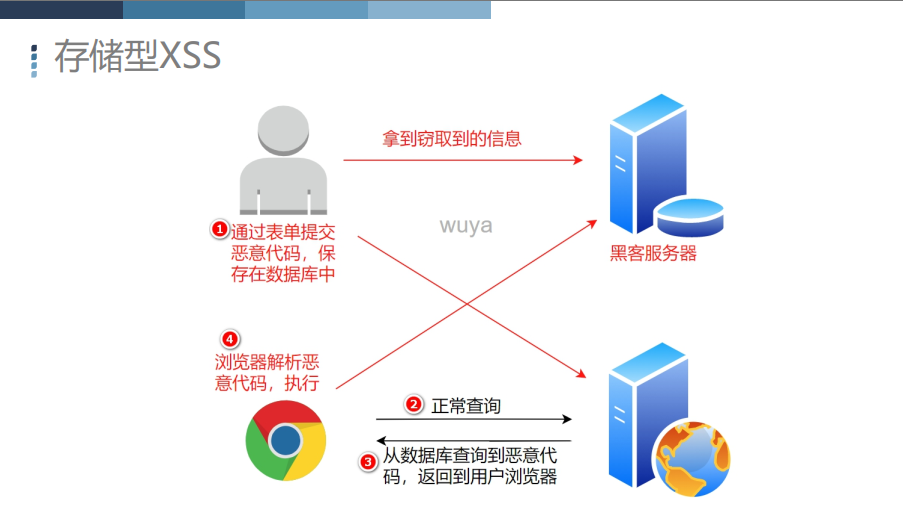

#### XSS ： Cross Site Script

Structured Query Language

恶意攻击者利用web页面的漏洞，插入一些恶意代码，当用户访问页面的时候，代码就会执行，这个时候就达到了攻击的目的。

JavaScript、Java、VBScript、ActiveX、Flash

总体可分为两大类型：反射型（dom），存储型

#### 反射型XSS



**反射型xss特点      每次使用都需要重复提交**

#### 存储型XSS



**存储型xss特点	       提交一次后，恶意代码存储在服务器内，每当有人访问此页面攻击就会一遍一遍的发生**


```
<script>alert(1)</script>
```

```
http://localhost/xss/get.html?url=http://www.baidu.com
```
