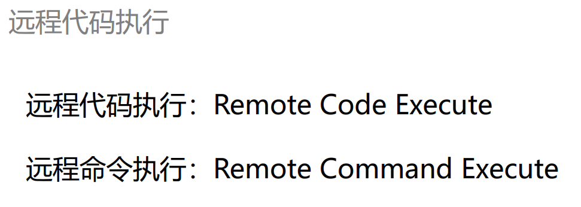
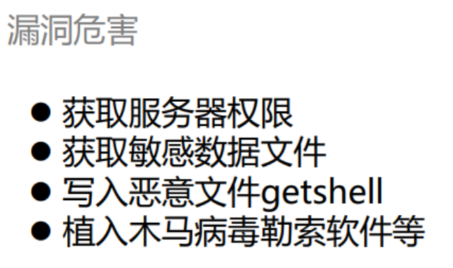
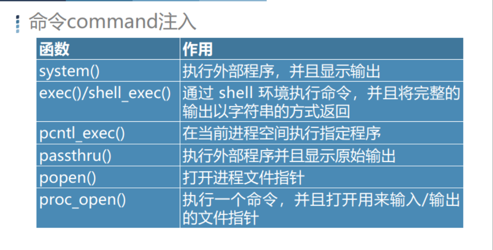
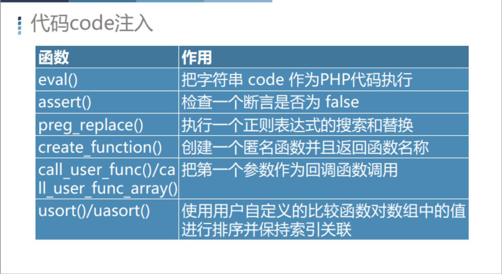
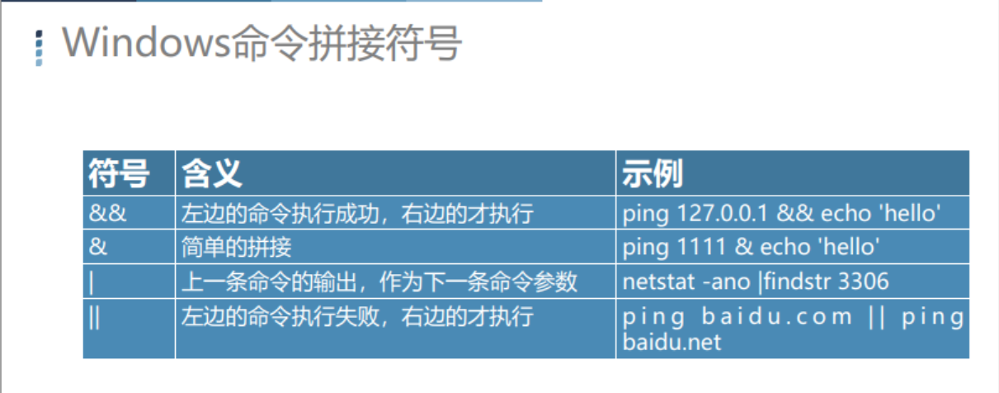
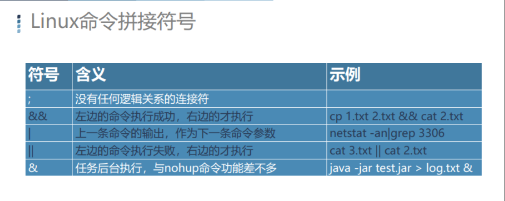

#### 什么是远程代码执行漏洞？



**RCE漏洞（命令注入漏洞），在程序里为了业务达到某些目的，预留了一些执行命令的接口，并将这些接口提供给web用户使用,最后又被黑客所利用**

RCE 也可以称 命令注入漏洞 command injection




#### PHP相关函数





#### **靶场案例**

##### **Windows命令拼接符号**



```sql
ping 127.0.0.1 && ipconfig
ping 127.0.0.1 & ipconfig
netstat -ano |findstr 3306

```

##### Linux命令拼接符号


